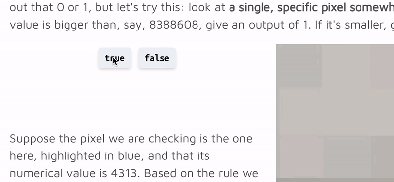

# About the Project

The [original project]([https://github.com/ecuber/mathexpo](https://github.com/ecuber/mathexpo)) that applied the concepts of this framework was created with `create-react-app` and bundles a clean default UI setup (using [chakra-ui]([https://chakra-ui.com/](https://chakra-ui.com/)) components) to minimize the friction when creating a math blog post.

## Features

- JSXGraph component built-in for making interactive 2D graphs
    - Supports both JessieCode and Javascript [graph logic](#using-jsxgraph)
- `math3d-component` for easy drop-in 3D graph creation
    - (Fairly) intuitive drag-and-drop UI
    - Flexible scene-saving mechanism
- `plotly.js` for more flexible kinds of graphs
- `chakra-ui` for themeable, accessible, and design system agnostic UI components
    - Also uses `@emotion/styled` for styling components with specific use-cases
- [`MathLive`](https://cortexjs.io/mathlive/) for both static TeX rendering and math input


## Using the Primitives

The "primitive" components included in this project make it really easy to throw together a beautiful math blog post, trusting that the content will be readable, responsive, and clean. Here are some examples of the ones you'll probably use most.

### Intro to Chakra

Many of the primitives rely on [ `chakra-ui`]([https://chakra-ui.com/](https://chakra-ui.com/)), an awesome UI library that has most enjoyable developer experience of anything I've ever tried. It has all the great features of Tailwind CSS or Bootstrap packaged into React components with intuitive prop names and amazing theming. While you don't necessarily need to touch Chakra yourself, if you need to change any of my components for any reason, here's a quick overview of some of the features I used.

#### Common Props

Keep in mind that (almost) all the styling props available on every Chakra component map to a regular CSS properties. You *can* treat them just the same way you would if you added a `style` prop to a div in React (all the names are the same!). However, we also get some nice ways to handle responsiveness that are good to know about.

|Name             |CSS Property                                                     |Examples                            |Notes                                                                   |
|-----------------|-----------------------------------------------------------------|------------------------------------|------------------------------------------------------------------------|
|m, ml, mt, mr, mb|margin, margin-left, margin-top, margin-right, margin-bottom     |m='auto' mr='10px' margin={25}      |numbers (pixels) or strings work                                        |
|p, pl, pt, pr, pb|padding, padding-left, padding-top, padding-right, padding-bottom|p='15px' pl='0.9rem' paddingTop={15}|                                                                        |
|mx/px            |margin-left and margin-right/padding-left or padding-right       |mx='auto' px='1rem'                 |will set both left and right margins/padding respectively               |
|my/py            |margin-top and margin-bottom/padding-top or padding-bottom       |my='2rem' py='1rem'                 |will set both top and bottom margins/padding respectively               |
|display          |display                                                          |display='inline-block'              |'flex', 'block', etc.                                                   |
|size             |font size, width, height                                         |size='xl' size='md' size='2xl'      |a Button or Heading component will react differently to different sizes.|
|w                |width                                                            |w='100%' width='400px'              |                                                                        |


#### Responsive Props

One of the most handy and intuitive features Chakra offers is the ability to set responsive styling based on the screen size. Here's an example:

```jsx
// import { Image } from '@chakra-ui/react'
<Image
  alt='x y plane with with the point (2, 3) plotted on it'
  loading='lazy'
  w={{ base: '90%', sm: '70%', md: '50%' }}
  maxW={300}
  m='auto'
  mb='10'
  src='/assets/plane.svg'
/>
```

#### Changing the Theme

You can change the Chakra theme quickly by simply editing `src/utils/theme.js`. See [the documentation](https://chakra-ui.com/docs/theming/customize-theme) for more info.

To update base styles, you'll want to edit `src/index.css`-- everything should work just the same as doing it in Chakra or emotion styled components.


There's a couple different syntaxes that work for this, but notice that you can set multiple width's right in the `w` prop for different screen sizes. Check out the [Chakra documentation]([https://chakra-ui.com/docs/features/responsive-styles](https://chakra-ui.com/docs/features/responsive-styles)) for more on this.

### Rendering Equations
Instead of traditional MathJax or MathQuill, this project uses the newer [MathLive](https://cortexjs.io/mathlive/) package which offers some cool functionality like a built-in virtual keyboard for mobile and lightweight components.

This project has two implementations of MathLive, one for rendering static equations and the other for accepting math input. We're using [a React wrapper](https://github.com/ShaMan123/react-math-view) that turns all the configuration options into lovely typed component props that are pretty intuitive to figure out.

#### `StaticEq`
This component is used for rendering a static math equation, available both inline and in `display: block`. Here's a couple examples:

```jsx
import { StaticEq } from './components/layout'

{/* block equation */}
<StaticEq value='a^2+b^2=c^2'>

{/* inline equation */}
<p>The Pythagorean Theorem is <StaticEq inline value='a^2+b^2=c^2'></p>
```

#### `MathField`
The editable math field supports passing an onChange function so you can run whatever logic you need to in order to validate it. The `MathField` behaves differently from `StaticEq` in that there isn't a `value`; instead `defaultValue` represents the initial value to be rendered. **Value state is handled in the MathField component.** Use onChange to update a state value you will validate later.

Note that the virtual keyboard should appear automatically when a touch-enabled-device user focuses on the element.

```jsx
import { MathField } from './components/layout'

const Ex = props => {
  const [value, setValue] = useState('')
  return <>
    <MathField defaultValue='d=\sqrt[]{x^2+y^2}' onChange={e => {
      setValue(e.currentTarget.getValue())
    }}/>
    <p>{value}</p>
  </>
}

```

### Quizzes

#### `Quiz`

The array of the `Quiz`'s child elements is split into 2 halves. The first will be rendered as clickable **answer choices**, and the second contains the **responses** that can appear after the reader makes a choice. See the example below to see how that works. 

The `Quiz` component will leave space below the answer choices that is large enough to hold the response that corresponds with the answer they click. By default, this space will be as tall as the first response element (index `0` of the array of **responses**), but you can change that index via the `placeholder` holder prop. I recommend picking the correct response index as your placeholder, that way the page won't have to shift if the user picks the correct answer.

#### `Emoji`

One (optional) nice way to use the quiz component is to use emojis in the responses so the user gets quick visual feedback as to whether they were right or not. Use the `Emoji` component to automatically wrap emojis in a `<span>` and add an accessible `aria-label` to accommodate screen readers.

#### Example

```jsx
import React from 'react'
import { Quiz, Emoji } from './components/layout'

const App = props => (
  <div>
    <Quiz placeholder={0}>
      <>true</>
      <>false</>
      <><Emoji symbol='✅' label='green check mark'/> Exactly, great job!</>
      <><Emoji symbol='🤔' label='thinking face'/> Hmm, think again.</>
    </Quiz>
  </div>
  // If the user clicks `true` it will render a box containing `✅ Exactly, great job!`
  // If the user clicks `false` it will render a box containing `🤔 Hmm, think again.`
)
```

#### Result



### Float

One of the most useful responsive layout tricks is using the `float: right` or `float: left` CSS properties. To avoid needing to use CSS classes, I've implemented a `Float` component that is pretty nifty. Set the `dir` prop to `'right'` or `'left'` to float the div to the right or left, respectively.

```jsx
// src/app.js
import React from 'react'
import { Float } from './components/layout'

const App = props => (
  <>
    <div>some content before</div>
    <Float dir='right'>
      <Image src='./path/to/img.jpg'/>
    </Float>
    <div>some content after</div>
  </>
)
```

### Using JSXGraph

The JSXGraph component provides flexible options for "coding" your graphs. Their API is [thoroughly documented here]([https://jsxgraph.org/](https://jsxgraph.org/)).

To create graphs, you have a couple options. The first is to use their proprietary language called JessieCode, which has documentation [here]([https://jsxgraph.uni-bayreuth.de/wp/docs_jessiecode/](https://jsxgraph.uni-bayreuth.de/wp/docs_jessiecode/)). The second, far more robust option, is to code your graphs directly in javascript.

#### JessieCode

This is a regular JessieCode example with static logic (that is, the code for the logic will stay the same).

```jsx
// src/app.js
import React from 'react'
import { Graph2D } from './components/graphs'

const jessieLogic = `
// setting left, top, right, and bottom limits:
$board.setView([-0.1, 1.2, 1.2, -0.1]);

// axes
point(0, 0) <<id: 'origin', visible: false>>;
point(1, 0) <<id: 'east', visible: false>>;
point(0, 1) <<id: 'north', visible: false>>;
axis(origin, east) <<id: 'xaxis', ticks: <<minorHeight: 5, majorHeight: 12, drawZero: false, label: <<anchorX: 'middle', offset: [0, -14]>>>>>>;
axis(origin, north) <<id: 'yaxis', ticks: <<minorHeight: 5, majorHeight: 12, drawZero: false, label: <<anchorY: 'middle', offset: [14, 0]>>>>>>;
                            
pts = <<color: '#DDD',
  withLabel: false,
  strokeWidth: 2,
  strokeOpacity: 0.5,
  fixed: true>>;

c1 = <<color: 'teal'>>;
c2 = <<color: 'tomato'>>;

point(0.6, 0.6) pts, c1;
point(0.45, 0.5) pts, c1;
point(0.6, 0.45) pts, c1;
point(0.4, 0.45) pts, c1;

point(0.2, 0.7) pts, c2;
point(0.7, 0.1) pts, c2;
point(0.8, 0.9) pts, c2;
point(0.1, 0.1) pts, c2;
`

// have to pass jessieCode={true} like so to parse JessieCode
const App = props => <Graph2D jessieCode logic={logic} aspectRatio={1}/>

export default App
```

#### JavaScript

When defining a graph with JavaScript, you write a function that takes in the [board object]([https://jsxgraph.uni-bayreuth.de/docs/symbols/JXG.Board.html](https://jsxgraph.uni-bayreuth.de/docs/symbols/JXG.Board.html))

```jsx
// src/app.js
import React from 'react'
import { Graph2D } from './components/graphs'

// To see methods and properties available on the brd1 object, see its
// type definition here: https://jsxgraph.uni-bayreuth.de/docs/symbols/JXG.Board.html
const logic = brd1 => {
  // function code from https://www.npmjs.com/package/@sswatson/jsxgraph-react-js
  brd.suspendUpdate();
  var a = brd.create('slider', [[2, 8], [6, 8], [0, 3, 6]], { name: 'a' });
  var b = brd.create('slider', [[2, 7], [6, 7], [0, 2, 6]], { name: 'b' });
  var A = brd.create('slider', [[2, 6], [6, 6], [0, 3, 6]], { name: 'A' });
  var B = brd.create('slider', [[2, 5], [6, 5], [0, 3, 6]], { name: 'B' });
  var delta = brd.create('slider', [[2, 4], [6, 4], [0, 0, Math.PI]], { name: '&delta;' });

  brd.create('curve', [
    function (t) { return A.Value() * Math.sin(a.Value() * t + delta.Value()); },
    function (t) { return B.Value() * Math.sin(b.Value() * t); },
    0, 2 * Math.PI], { strokeColor: '#aa2233', strokeWidth: 3 });
  brd.unsuspendUpdate();
}

// Omit jessieCode prop to default to JavaScript logic
const App = props => <Graph2D logic={logic} aspectRatio={1}/>

export default App
```

#### Dynamically-Set Logic

There are some scenarios in which you will need to update the logic of a graph dynamically (e.g. the reader clicks a button that reveals the solution to a question posed in the text). To accomplish this, we can use a slick React trick to force a re-render even though the JSXGraph won't register the change in the props.

```jsx
// src/app.js
import React from 'react'
import PropTypes from 'prop-types'
import { Graph2D } from './components/graphs'

const initialLogic = `
...jessiecode logic goes here...
`

const solutionLogic = `
...solution logic goes here...
`

// If props.solution is true, then we render solutionLogic.
// Otherwise, render intialLogic.

const App = props => {
  const [rerenders, setRerenders] = useState(0)
  // Side-effect hook runs every rerender when props.solution changes.
  useEffect(() => {
    setRerenders(rerenders + 1)
  }, [props.solution])  

  <Graph2D
    key={rerenders}
    jessieCode
    logic={props.solution ? solutionLogic : initialLogic}
    aspectRatio={1}
  />
}

App.propTypes = {
  solution: PropTypes.bool
}

export default App
```

## Using Math3D Component

Unlike the JSXGraph components, you should *probably*\* use the built-in UI to generate your scene code. I set the component up to give you the internally generated JSON object containing all the data used to render the scene. The component is documented in a bit more detail [here]([https://github.com/ecuber/math3d-component/blob/master/client/README.md](https://github.com/ecuber/math3d-component/blob/master/client/README.md)), and it would be a good idea to at least get familiar with the [props]([https://github.com/ecuber/math3d-component/blob/master/client/README.md#component-props](https://github.com/ecuber/math3d-component/blob/master/client/README.md#component-props)) as I'll be regularly referencing them here.

\* You'll want to read the [`folders`, `mathSymbols`, and `mathGraphics`](#math-objects) if you choose to generate the JSON programatically.

### Understanding the JSON Format

Let's say for the sake of this example we are trying to save a slightly edited version of the default [math3d.org](http://math3d.org) scene (the one that shows up when you first load the page). Here's a gif of what our scene looks like: 


Alright, now let's take a look at what the graph looks like in JSON:

```json
{
	"metadata": {
	  "id": "mO1QsICp",
	  "title": "A Cool Title Might Go Here But Its Invisible In Prod"
	},
	"sortableTree": {
	  "18": [
	    "19",
	    "20"
	  ],
	  "root": [
	    "mainFolder",
	    "18"
	  ],
	  "mainFolder": [
	    "16",
	    "17"
	  ]
	},
	"folders": {
	  "18": {
	    "description": "Folder 2"
	  },
	  "mainFolder": {
	    "description": "Folder 1"
	  }
	},
	"mathSymbols": {
	  "16": {
	    "type": "VARIABLE",
	    "name": "f(x,\\ y)",
	    "value": "x^2-y^2+2"
	  },
	  "20": {
	    "type": "VARIABLE_SLIDER",
	    "name": "t",
	    "isAnimating": true
	  }
	},
	"mathGraphics": {
	  "17": {
	    "type": "EXPLICIT_SURFACE",
	    "color": "#2ecc71",
	    "expr": "_f(x,y)=f\\left(x,\\ y\\right)"
	  },
	  "19": {
	    "type": "POINT",
	    "coords": "\\left[t,0,f\\left(t,\\ 0\\right)\\right]"
	  },
	  "camera": {
	    "type": "CAMERA",
	    "relativePosition": [
	      0.7990185465207001,
	      -1.6724537671141628,
	      1.0317304682820954
	    ],
	    "relativeLookAt": [
	      0,
	      0,
	      0
	    ]
	  }
	},
	"sliderValues": {
	  "20": 1.708333333333335
	}
}
```

Now, let's go through key-by-key to understand what's going on here.

#### `metadata`

```json
"metadata": {
  "id": "mO1QsICp",
  "title": "A Cool Title Might Go Here But Its Invisible In Prod"
}
```

The metadata tag is present in every scene object and is auto-generated every time you create a new blank instance of the component. The title comes from the title box in the header div that appears when dev mode is activated, but keep in mind that the entire header is invisible when the dev prop is not activated.

You may manually change the id and the component will leave it as-is on every subsequent save, allowing you freedom to rename id's to your heart's content.

#### `sortableTree`

```json
"sortableTree": {
  "18": [
    "19",
    "20"
  ],
  "root": [
    "mainFolder",
    "18"
  ],
  "mainFolder": [
    "16",
    "17"
  ]
}
```

We find ourselves now in the realm of things that I still don't fully understand about Math3D and make it a pain to work with! This object contains the keys that reference the "math objects" (folders, functions, points, graphs, etc. as they're called in Math3D) as they would appear in the sidebar. The math objects themselves are stored in the folders, mathSymbols, and mathGraphics objects below this one.

I'm fairly certain that the reason we have this setup is so that the underlying `react-beautiful-dnd` (drag and drop HOC) can handle dragging to reorder, although I've never used the library before. 

<h4 id="math-objects"><code>folders</code>, <code>mathSymbols</code>, and <code>mathGraphics</code></h4>

```json
"folders": {
    "18": {
      "description": "Folder 2"
    },
    "mainFolder": {
      "description": "Folder 1"
    }
  },
  "mathSymbols": {
    "16": {
      "type": "VARIABLE",
      "name": "f(x,\\ y)",
      "value": "x^2-y^2+2"
    },
    "20": {
      "type": "VARIABLE_SLIDER",
      "name": "t",
      "isAnimating": true
    }
  },
  "mathGraphics": {
    "17": {
      "type": "EXPLICIT_SURFACE",
      "color": "#2ecc71",
      "expr": "_f(x,y)=f\\left(x,\\ y\\right)"
    },
    "19": {
      "type": "POINT",
      "coords": "\\left[t,0,f\\left(t,\\ 0\\right)\\right]"
    },
    "camera": {
      "type": "CAMERA",
      "relativePosition": [
        0.7990185465207001,
        -1.6724537671141628,
        1.0317304682820954
      ],
      "relativeLookAt": [
        0,
        0,
        0
      ]
    }
  }
```

The most important thing to notice here is that all of the object keys are unique integers that are not necessarily in order (with the exception of `mainFolder` and `camera`, more on that in a moment). **If you're generating a scene with a script, you'll need to make sure that there are no repeated keys in any of these three objects.** 

Another caveat to this structure is that the keys are not always chosen in a logical order. I exported this JSON after making the graph manually, and as you can see, there are far fewer than 21 children across the three parent objects, and yet the highest "index" is 20. If you are generating your own graph, this isn't a problem; as long as all the keys are strings and unique the sorting and rendering should work fine. **However, if you or the user creates a new math object in the UI at runtime, there is a chance it will break everything** by creating a new object with the same key as one that already exists (causing the JSON loader or whatever to throw a nasty error saying "there's two key 16's and I don't know why" and making the whole website go whitescreen). I haven't thoroughly tested it, but it does seem that not every kind of math object is the same, but Points definitely do trigger the whitescreen. I would imagine a bit of investigation on the component-side would reveal the problem pretty quickly.

If you choose to programmatically generate a scene you'll either need to wrap the component in an ErrorBoundary just in case the user does make a new point or something, or investigate the logic for key-generation on the component-side and make it more predictable.

`mainFolder` and `camera` are default objects that will always be present in their respective sections. `mainFolder` is just the first folder that is present by default when you create a new scene. Not sure why it isn't just `"0"` or something more logical.

`camera` is contains all the camera position data that tells the component how to point the camera, etc. This data can be changed through the UI via the `Camera Controls` tab, or manually here.

#### `sliderValues`

```json
"sliderValues": {
  "20": 1.708333333333335
}
```

Again, I'm not sure why, but the numeric values of all the sliders are stored separately from the slider object itself in the `mathSymbols` section. The key has to correspond with an existent object in `mathSymbols`.

### Using the Component

The base component is also documented [here]([https://github.com/ecuber/math3d-component/blob/master/client/README.md#component-props](https://github.com/ecuber/math3d-component/blob/master/client/README.md#component-props)). These examples assumes we're using the wrapped component from the project, but all the props we pass to `Graph3D` are passed via `{...props}` to the actual `Math3D` child component. 

#### Static Graph

To render a static graph, all we need to do is pass the dehydrated scene object (that's the JSON from above) to the dehydrated prop. This will render the graph with the drawer closed by default and hide the header. To reveal the drawer by default, just add the `drawer` prop

```jsx
// src/app.js
import React from 'react'
import Graph3D from './components/graphs'
import scenes from './content/graphs.json'

// no drawer
const App = props => <Graph3D dehydrated={scenes.pjs7lop2}/>

// with drawer
const AppWithDrawer = props => <Graph3D dehydrated={scenes.pjs7lop2} drawer/>

export default App
```

#### Development Mode

If you're in the process of editing your graph, you'll want to enable dev mode. Do this by setting the `dev` prop to true.

You will also need to set a save callback function in the `save` prop. This function will be passed the latest dehydrated scene every time you click the save button, so it should somehow store that JSON data, whether in a JSON file or in a database or whatever else it may be.

Here's an example where we make a call to a local webserver (proxied from the default port to localhost:5000). In the backend, we have logic that will either save a new entry to a JSON file or update an existing scene.

```jsx
// src/app.js
import React from 'react'
import Graph3D from './components/graphs'

// POSTs to an API endpoint that saves the graph to a file
const saveGraph = dehydrated => {
    fetch('dev/save', {
    method: 'POST',
    headers: {
      'Content-Type': 'application/json'
    },
    body: JSON.stringify({ dehydrated })
  } )
  .then((res) => {
    if (res.ok) {
      console.log('successfully saved graph!')
    }
  } )
}

// in dev mode, drawer will always be open by default
const App = props => <Graph3D dev save={saveGraph}/>

// ADD THE `dehydrated` PROP IMMEDIATELY AFTER FIRST SAVE
// TO PREVENT ACCIDENTAL DATA LOSS

export default App
```

**Notice that in this example, we don't have a `dehydrated` prop set yet.** If you're developing a new graph, I recommend immediately saving the initial scene before making any edits. Then, add the reference to the dehydrated graph in the code. That way, you can continuously save the graph as you make edits and any accidental reloads will keep rendering the latest version of the graph.

## Plotly Graphs
To implement Plotly, this project just uses the official [Plotly React Wrapper](https://plotly.com/javascript/react/) which makes it really easy to drop in a graph. Check out their documentation for more info on using the component. 

If you'd like an easy way to create a Plotly plot, feel free to use [Plotly Chart Studio](https://chart-studio.plotly.com/create/). Then, copy the data from the JSON menu (in the dropdown menu on the left) and add it to the appropriate prop in the `Plot` component.

Some basic styles and window size event listeners have been implemented in my `Plot` component which can be found in `src/components/graphs/components/Plot.js`. Here's an example implementation. **Note that the Plot is wrapped in a Chakra `Box`. You can therefore pass a `style` prop or any of the supported Chakra props and they will apply to the container surrounding the Plot.**

```jsx
import { Plot } from './compnents/graphs'
import { data, layout, config } from './content/plotly.json'

<Plot marginY='2rem' data={data} layout={layout} config={config}/>
```
